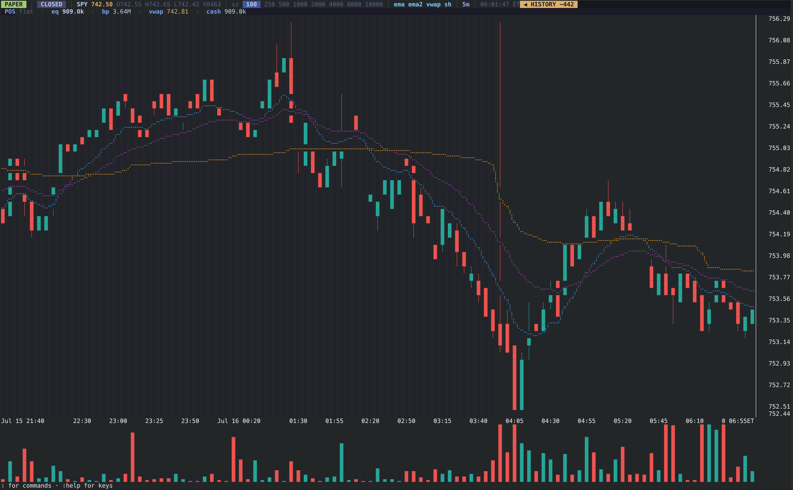

# trade-kernel

A low-latency terminal trading app for US equities on
[Alpaca](https://alpaca.markets), built for speed: keyboard-first order
entry, full 24/5 session support (overnight, pre-market, regular,
after-hours), braille candlestick charts with dual-EMA/VWAP overlays,
and hard safety rails. Runs on a server near Alpaca; you attach over
SSH + tmux.



## Features

- **All sessions tradable.** Orders outside regular hours automatically
  convert to aggressive limit orders (`extended_hours=true`, far side of
  the NBBO ± configurable slippage), with an overnight-eligibility check
  per symbol. The status bar always shows the current session and, when
  confirmations are on, the converted limit price before submission.
- **Fast order entry.** One keystroke to buy/sell/add/reduce/flatten
  with preset sizes; `:` command line for custom orders.
- **Safety rails.** Max order size, max position size, and duplicate-order
  debounce. `X` is the panic key (cancel + flatten the active symbol).
- **Charts.** Candlesticks in braille (2×4 dots/cell), volume pane,
  dual EMA/session-VWAP overlays, per-session background shading,
  resolutions from 1s to 1d, weekend/holiday gaps collapsed. Focus mode
  (`[` / `]` or `:focus N`) crops the chart toward the live edge so a new
  low-volume session isn't squashed by the prior session's peaks. Live
  overnight: Alpaca's websocket doesn't stream the overnight session, so
  20:00–04:00 ET the chart, volume, and last price are kept live by
  polling the BOATS REST feed every 2 s.
- **Resilient.** WebSocket auto-reconnect with REST backfill plus a
  ping/pong watchdog (detects silently dead connections during quiet
  hours), state reconciliation on startup and reconnect, client order
  IDs for idempotency, keypress→ack latency (p50/p99) in the status bar.

## Quickstart

Requires Go 1.24+ and an Alpaca account (paper works; SIP data requires
the Algo Trader Plus data plan).

```bash
# 1. Build
go build -o trade-kernel ./cmd/trade-kernel

# 2. Configure
cp config.example.yaml trade-kernel.yaml   # edit to taste

# 3. Credentials — either set them in trade-kernel.yaml:
#      api_key_id: PK...
#      api_secret_key: ...
#    or export env vars (these override the file if both are set):
export APCA_API_KEY_ID=...
export APCA_API_SECRET_KEY=...

# 4. Run (paper by default)
./trade-kernel
```

## Usage

### Hotkeys (all rebindable in config)

| Key | Action |
|---|---|
| `B` / `S` | Buy / sell preset size |
| `A` / `D` | Add to / reduce position |
| `F` | Flatten entire position |
| `C` | Cancel open orders for the active symbol |
| `X` | Panic: cancel active-symbol orders + flatten it (no confirmation) |
| `1`–`9` | Select size preset |
| `Tab` / `Shift+Tab` | Cycle chart resolution forward / backward |
| `←` / `→` | Pan chart back into history / forward toward live |
| `[` / `]` | Focus: narrow chart toward the live edge / widen back (rebases volume scale when a new low-volume session starts) |
| `i` | Cycle indicator overlays |
| `:` | Command line |
| `q` / `Ctrl+C` | Quit / force quit |

### Commands

```
:buy 250 lmt 152.30      limit buy        :sell 100 mkt     market sell
:sym NVDA                switch symbol    :tf 5m|2m|30s     chart timeframe
:preset 2                size preset      :flatten          close position
:cancel                  cancel active    :lock [reason]    engage risk lock
:unlock                  release lock     :panic             panic active symbol
:confirm on|off          toggle confirms  :shading on|off   toggle shading
:focus N|off             crop to last N bars :quit             quit
:help                    key summary
```

### How orders are built

| Session | Hotkey order | `:... lmt PRICE` |
|---|---|---|
| Regular | market, TIF=`orders.regular_tif` (default `day`, or `ioc`) | limit, same TIF |
| Pre-market / after-hours | limit at NBBO far side ± slippage, `extended_hours=true` | limit as given, `extended_hours=true` |
| Overnight | same + symbol eligibility check | same |
| Closed | rejected | rejected |

Stale NBBO (>3 s) falls back to pricing off the last trade with a
warning. Flatten/panic may still price off a last trade up to ~5 minutes
old on quiet extended/overnight tape (with a warning) so exits do not
hard-fail when the book is empty. Flatten/reduce are direction-aware
from the position sign; size is re-read at submit (REST first, local
fallback on error). Regular-hours flatten always uses day TIF even when
`orders.regular_tif` is `ioc`.

## Safety

- **Paper first.** Live trading needs both `paper: false` and
  `live_trading_acknowledged: true`, and prints a warning banner.
- **Size rails.** Max order qty and projected max position qty including
  **same-side resting open orders** (strict same-sign reduce while over the
  cap is allowed; equal-magnitude or oversize reverse while over the cap is
  rejected); short duplicate-order debounce on new risk. Flatten and panic
  do not invoke the checker (full bypass).
- **Panic (X / `:panic`).** Cancels open orders for the active symbol and
  flattens that symbol only (bypasses checks/confirmation; REST-first
  position lookup, trusts REST flat even if local lag still shows size).
- **Manual lock.** `:lock [reason]` engages the kill-switch until
  `:unlock` (new risk rejected; **flatten and panic still work**).
- **Confirmations.** `confirm_orders: true` shows every order (with the
  converted limit price in extended sessions) before submission. Session
  class and order form are pinned at confirm time so a session boundary
  cannot change market↔limit under your finger.

## Development

```bash
go build ./... && go vet ./... && go test -race ./...
```

See [DESIGN.md](DESIGN.md) for the architecture, package map, order
builder rules, failure handling, and testing strategy.

## Local latency tips

Order RTT is dominated by network distance to Alpaca; the app cannot beat
that from a laptop. It *does* warm the trading HTTPS connection at startup,
prefetch overnight eligibility per symbol, and refresh the chart on a
configurable tick (`chart.tick_ms`, default 50 ms, adaptive by TF).

When measuring buy/sell speed:

1. Set `confirm_orders: false` (or `:confirm off`) — y/n dominates otherwise.
2. Ignore the first order after a long idle; watch status-bar **p50/p99** after a few submits.
3. Prefer a low-jitter network (wired, no extra VPN hop when testing).
4. Use `1s`/`5s` for price-action feel. Raising `tick_ms` mainly slows mid TFs
   (e.g. `1m`); live short TFs stay at `min(base, 33ms)`, while high TF / pan /
   closed already floor at ≥100 ms. On a low-power laptop, switch to a higher TF
   or pan history rather than expecting `tick_ms: 100` alone to cut short-TF CPU.

For the lowest order RTT, still deploy near Alpaca (see below).

## Deployment

See [deploy/SETUP.md](deploy/SETUP.md): GCP region selection by RTT
measurement, systemd + tmux unit, secrets handling, attach over SSH
(`ssh -t host 'tmux attach -t trade-kernel'`).

## License

MIT — see [LICENSE](LICENSE).
